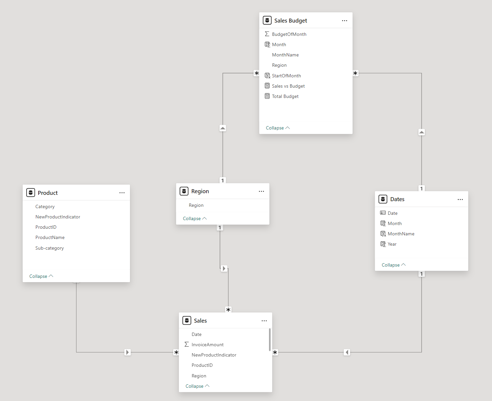

# Business Context

We have a request for creating dashboard for a company that sells bike and accessories.

Raw data combines below Excel tables:
- Sales

- Product

- Sales Budget

Dashboard includes:
- Sales Trend Y/Y
- New product sales vs budget
- %New product Sales vs Total
- Top 3 new products 
- Detail level: By month, by Region, by Category

# Approaches
- Import the datasets to Power Query, clean and transform them: deduplicate, unpivot, change to approriate data types
- Create data model
- Create visualization

Data Model

# Dashboard
Download Power BI dashboard [here](/New%20Product%20Sales%20Performance%20Dashboard%20v2.pbix)

